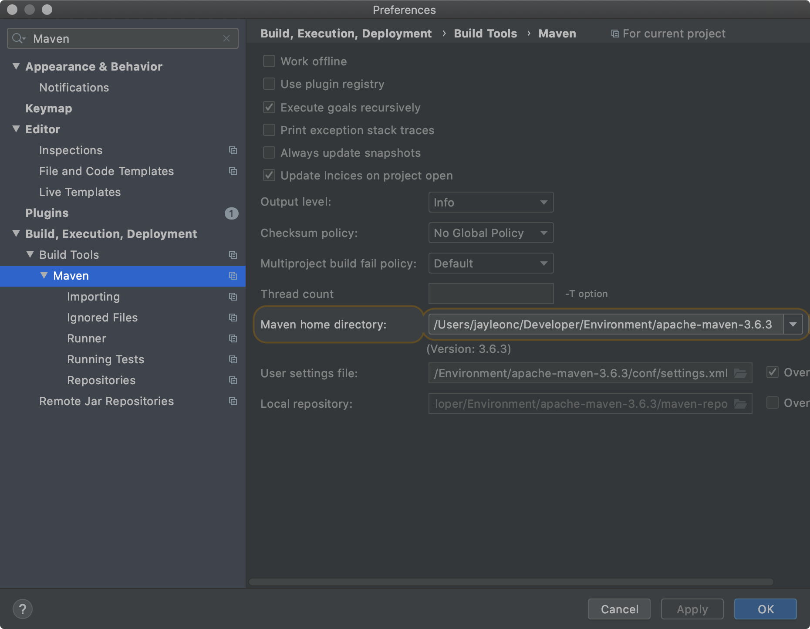

# IMDB

#### 软件架构
Spring + SpringMVC + Mybaitis

#### 运行环境

IntelliJ IDEA + Maven


#### 安装教程

1.  在数据库中执行注目下的imdb.sql。（导入数据库和表以及一些数据）
2.  修改程序 imdb\src\main\resources\applicationContext.xml，配置其中的数据源（dataSource）
```xml
<bean id="dataSource" class="com.mchange.v2.c3p0.ComboPooledDataSource">
        <property name="driverClass" value="com.mysql.cj.jdbc.Driver"/>
        <property name="jdbcUrl" value="jdbc:mysql://47.113.84.150:3306/imdb?characterEncoding=UTF-8&amp;useSSL=false"/>
        <property name="user" value="root"/>
        <property name="password" value="jayleonc"/>
 </bean>
```
3.  修改imdb\src\main\java\com\jayleonc\config\ParamConfig.java 中的私有变量img_path ：
```java
/*
* 实现前端上传图片功能
* Tomcat服务器或是Nginx服务器或是其他服务器设置的静态资源访问地址
* 这里使用本项目的webapp路径
* 2020.07.27 20:12
*/
private final String img_path = "/Users/jayleonc/imdb/imdb/src/main/webapp/images";

```

#### 使用说明

1.  导入idea，部署maven依赖，配置好tomcat服务器即可运行。
2.  需直接导入src的上一级目录（imdb）
